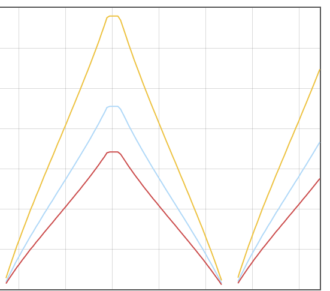

# Metric generator

A simple Go app that exposes its metrics to Prometheus

## How to build

```
go mod init rogal.net/metric-generator
go mod tidy
go build
./metric-generator -listen-address=:8080
```

## Docker

```
docker build . -t metric-generator
docker run --rm -p 8080:8080 metric-generator
```

## Prometheus

All metrics will be available on Prometheys.  
It is required to change `metric-generator` IP address to local IP address (not localhost or 127.0.0.0).  
See the file [prometheus.yml#28](./prometheus.yml#28)

```
cd prom
docker compose up
```

Access it at [localhost:9090](http://localhost:9090)

## Querying metrics

Run the metric `avg(rate(rpc_durations_seconds_count[5m])) by (job, service)` on a 30m range.  

